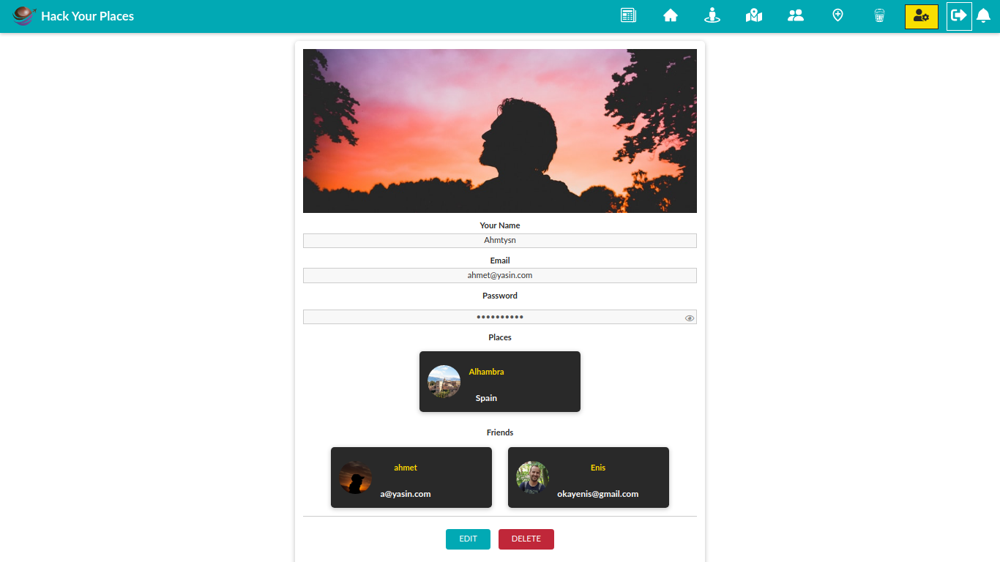
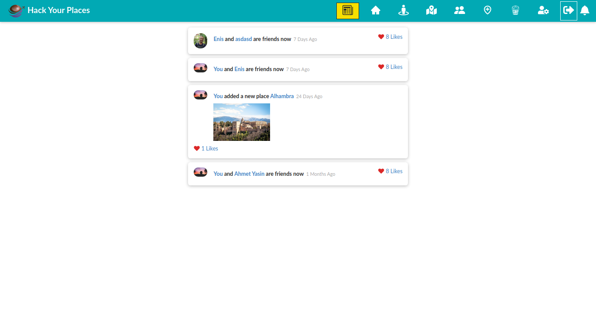
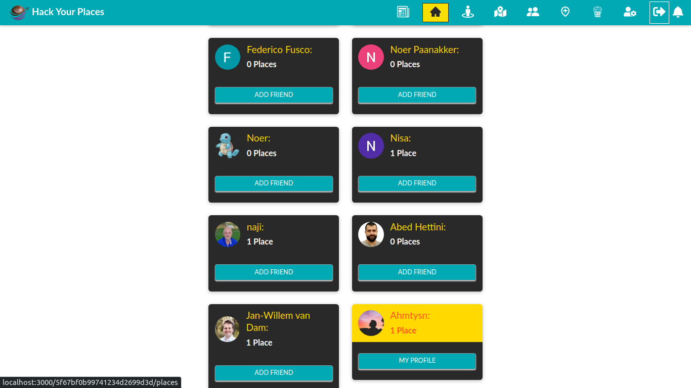
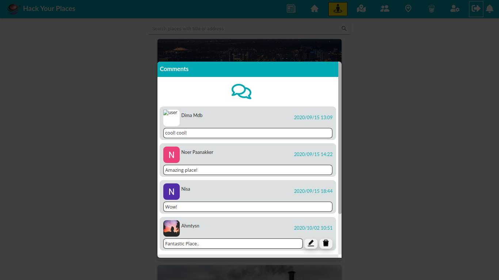
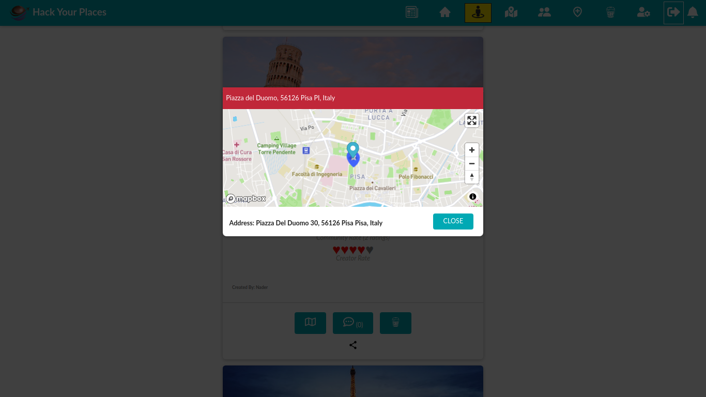
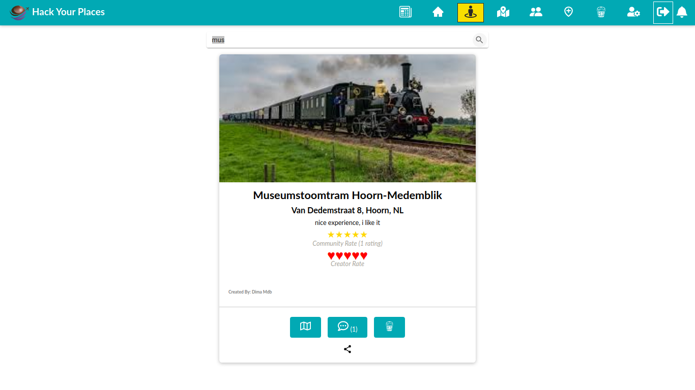
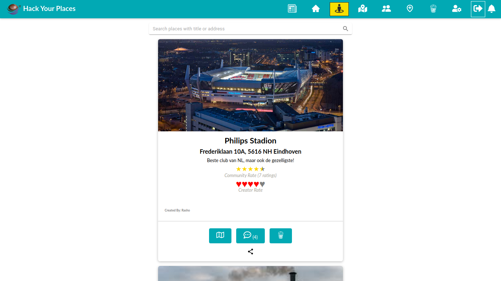
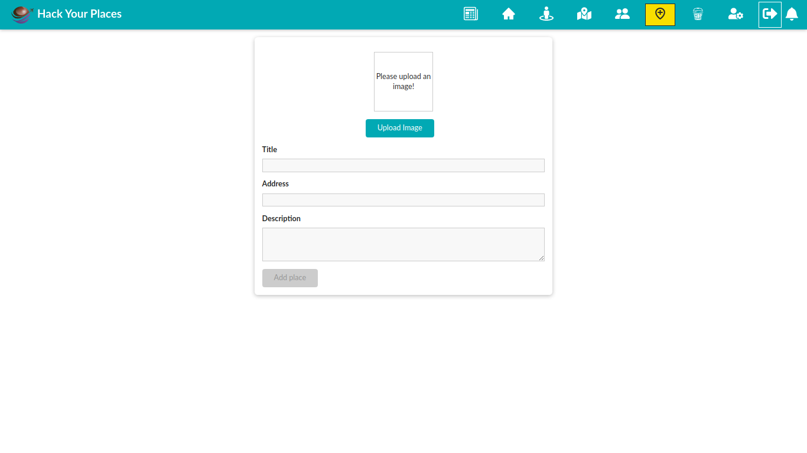

# Share Places Social App Project by Hack Your Future Class 26 Team members

This repo created by Hack Your Future class26 team. Here you will see forked repo, if you want to see real repo please click [here](https://github.com/HackYourFuture/class26-project)

<h2>App functions:</h2>
<ul>
<li>- You can sign-up, login and logout also with using facebook or google account</li>
<li>- Share your most favorite places.</li>
<li>- Find amazing places shared by users and add in your bucket list.</li>
<li>- You can score places with amazing star icons.</li>
<li>- Add many friends and start communication.</li>
<li>- Comment other peoples shared places.</li>
<li>- Start a friendship with different users with sending friend request</li>
<li>- Add edit and delete places.</li>
<li>- See your places in a most detailed map.</li>
<li>- With perfect account page, check your all information, maybe you want to change sth else !</li>
</ul>

<h2>Deployment: </h2>
Now the online deployment of the project is available; 
Just click [here](https://hackyourplaces-c26.herokuapp.com) in order to see todo-list app!

<h2>Getting Started with files</h2>

To get started you can simply clone the repo and install the dependencies in the root `folder`

| Steps   | with [NPM](https://www.npmjs.com/) |
| ------- | ---------------------------------- |
| Install | `npm install`                      |
| Run     | `npm run dev`                      |

<h2>Techs</h2>
<h3>MERN Stack</h3>
<ul>
  <li> MongoDB - document database</li>
  <li> Express(.js) - Node.js web framework</li>
  <li> React(.js) - a client-side JavaScript framework</li>
  <li> Node(.js) - the premier JavaScript web server</li>
</ul>
    
<h2>App Sketch</h2>











<h2>File tree</h2>

```
├── build
│   ├── asset-manifest.json
│   ├── favicon.ico
│   ├── index.html
│   ├── logo192.png
│   ├── logo512.png
│   ├── manifest.json
│   ├── precache-manifest.34aa883dd935da8cb87a1e1772b67337.js
│   ├── robots.txt
│   ├── service-worker.js
│   └── static
│       ├── css
│       │   ├── 0.6ffa563c.chunk.css
│       │   ├── 0.6ffa563c.chunk.css.map
│       │   ├── 4.aa7cb2e3.chunk.css
│       │   ├── 4.aa7cb2e3.chunk.css.map
│       │   ├── 5.1c1ecdd8.chunk.css
│       │   ├── 5.1c1ecdd8.chunk.css.map
│       │   ├── 6.ea60d3b6.chunk.css
│       │   ├── 6.ea60d3b6.chunk.css.map
│       │   ├── 7.c8a152e9.chunk.css
│       │   ├── 7.c8a152e9.chunk.css.map
│       │   ├── 8.da953122.chunk.css
│       │   ├── 8.da953122.chunk.css.map
│       │   ├── main.f9bd2671.chunk.css
│       │   └── main.f9bd2671.chunk.css.map
│       └── js
│           ├── 0.d3e8ee55.chunk.js
│           ├── 0.d3e8ee55.chunk.js.map
│           ├── 3.69ac0d1f.chunk.js
│           ├── 3.69ac0d1f.chunk.js.LICENSE
│           ├── 3.69ac0d1f.chunk.js.map
│           ├── 4.45226030.chunk.js
│           ├── 4.45226030.chunk.js.map
│           ├── 5.7bb365d9.chunk.js
│           ├── 5.7bb365d9.chunk.js.map
│           ├── 6.a0b625a3.chunk.js
│           ├── 6.a0b625a3.chunk.js.map
│           ├── 7.d9112c44.chunk.js
│           ├── 7.d9112c44.chunk.js.map
│           ├── 8.69370c74.chunk.js
│           ├── 8.69370c74.chunk.js.map
│           ├── main.f188c53c.chunk.js
│           ├── main.f188c53c.chunk.js.map
│           ├── runtime-main.f6d12ad7.js
│           └── runtime-main.f6d12ad7.js.map
├── package.json
├── package-lock.json
├── public
│   ├── favicon.ico
│   ├── index.html
│   ├── logo.png
│   ├── manifest.json
│   └── robots.txt
├── README.md
└── src
    ├── App.js
    ├── friends
    │   ├── components
    │   │   ├── AcceptFriendReq.js
    │   │   ├── AddFriend.js
    │   │   ├── DeleteFriend.js
    │   │   ├── friendItem.css
    │   │   ├── FriendItem.js
    │   │   ├── FriendReqList.js
    │   │   └── RejectFriendReq.js
    │   └── pages
    │       └── UserFriends.js
    ├── home
    │   ├── components
    │   │   ├── Banner.css
    │   │   ├── Banner.js
    │   │   ├── Features.css
    │   │   ├── Features.js
    │   │   ├── Gallery.css
    │   │   └── Gallery.js
    │   ├── HomePage.css
    │   └── HomePage.js
    ├── images
    │   ├── background.jpg
    │   ├── feature1.png
    │   ├── feature2.png
    │   ├── feature3.png
    │   ├── header.png
    │   └── Logo.png
    ├── index.css
    ├── index.js
    ├── places
    │   ├── components
    │   │   ├── BucketList.css
    │   │   ├── BucketListItem.css
    │   │   ├── BucketListItem.js
    │   │   ├── BucketList.js
    │   │   ├── Comment.css
    │   │   ├── Comment.js
    │   │   ├── CommentList.css
    │   │   ├── CommentList.js
    │   │   ├── PlaceForm.css
    │   │   ├── PlaceForm.js
    │   │   ├── PlaceItem.css
    │   │   ├── PlaceItem.js
    │   │   ├── PlaceList.css
    │   │   └── PlaceList.js
    │   └── pages
    │       ├── AllPlaces.js
    │       ├── EditPlace.js
    │       ├── NewPlace.js
    │       ├── placePage.css
    │       ├── PlacePage.js
    │       └── UserPlaces.js
    ├── shared
    │   ├── components
    │   │   ├── FormElements
    │   │   │   ├── Button.css
    │   │   │   ├── Button.js
    │   │   │   ├── ImageUpload.css
    │   │   │   ├── ImageUpload.js
    │   │   │   ├── Input.css
    │   │   │   ├── Input.js
    │   │   │   └── SearchBar.js
    │   │   ├── Navigation
    │   │   │   ├── MainHeader.css
    │   │   │   ├── MainHeader.js
    │   │   │   ├── MainNavigation.css
    │   │   │   ├── MainNavigation.js
    │   │   │   ├── NavLinks.css
    │   │   │   ├── NavLinks.js
    │   │   │   ├── NotificationList.css
    │   │   │   ├── NotificationList.js
    │   │   │   ├── NotificationNavBar.js
    │   │   │   ├── SideDrawer.css
    │   │   │   └── SideDrawer.js
    │   │   └── UIElements
    │   │       ├── Avatar.css
    │   │       ├── Avatar.js
    │   │       ├── Backdrop.css
    │   │       ├── Backdrop.js
    │   │       ├── Card.css
    │   │       ├── Card.js
    │   │       ├── LoadingSpinner.css
    │   │       ├── LoadingSpinner.js
    │   │       ├── Map.css
    │   │       ├── Map.js
    │   │       ├── Modal
    │   │       │   ├── ErrorModal.js
    │   │       │   ├── Modal.css
    │   │       │   ├── Modal.js
    │   │       │   └── ModalOverlay.js
    │   │       ├── StarRating.css
    │   │       └── StarRating.js
    │   ├── context
    │   │   └── auth-context.js
    │   ├── hooks
    │   │   ├── auth-hook.js
    │   │   ├── form-hook.js
    │   │   └── http-hook.js
    │   └── utils
    │       └── validators.js
    └── users
        ├── components
        │   ├── AccountSettings.css
        │   ├── AccountSettings.js
        │   ├── AuthForm.css
        │   ├── AuthForm.js
        │   ├── FriendFeedUI.js
        │   ├── newsfeedlist.css
        │   ├── NewsFeedList.js
        │   ├── PlacesFeedUI.js
        │   ├── ProfileFriendsItem.js
        │   ├── ProfileItem.css
        │   ├── ProfilePlaceItem.js
        │   ├── ResetPasswordForm
        │   │   ├── ButtonResetPassword.js
        │   │   ├── FormPassword.css
        │   │   ├── FormPassword.js
        │   │   ├── FormResetPassword.js
        │   │   └── InputResetPassword.js
        │   ├── UserItem.css
        │   ├── UserItem.js
        │   ├── UsersList.css
        │   └── UsersList.js
        └── pages
            ├── AuthPage.js
            ├── ForgotPassword.js
            ├── NewsFeed.js
            ├── ResetPassword.js
            ├── UserProfile.js
            └── UsersPage.js

```
